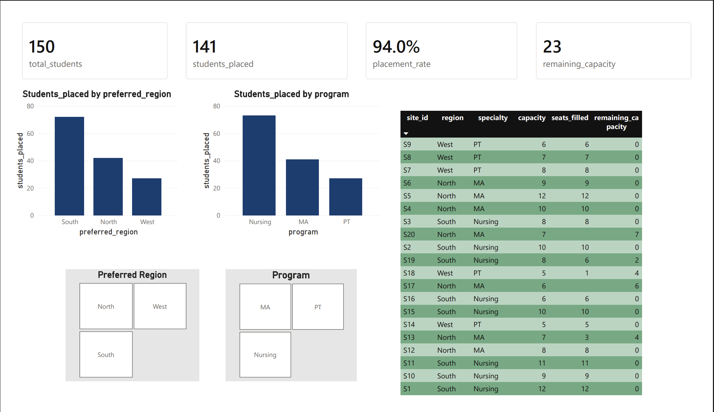

# Student Placement Optimization Dashboard

Power BI + Python project simulating a clinical placement optimization workflow.

This project demonstrates data preparation, assignment logic, and interactive dashboard reporting to track placement efficiency, utilization, and remaining capacity.

Note: All data in this project is simulated for portfolio/demo purposes.

---

## Dashboard Preview

---

## Project Objective

The goal of this project is to simulate assigning students to clinical sites based on:

- region preference
- program type
- site capacity constraints

Then visualize outcomes in a dashboard to monitor:

- overall placement rate
- placement volume by region/program
- remaining capacity by site

This mirrors real-world operations analytics and resource allocation use cases.

---

## Tools & Technologies

- Power BI (data modeling + dashboard development)
- Python (data preparation / assignment logic)
- Pandas
- CSV data structures
- Git & GitHub

---

## Project Structure
student-placement-dashboard/
│
├── data/
├── images/
├── powerbi/
├── scripts/
│ └── dashboard_preview.png
└── README.md

---

## Key Metrics Included

- Total Students
- Students Placed
- Placement Rate
- Remaining Capacity
- Students Placed by Region
- Students Placed by Program
- Site Capacity / Seats Filled / Remaining Capacity (table)

---

## Business Insights Demonstrated

- Capacity bottlenecks by site and region
- Which programs face placement constraints
- Where additional clinical partnerships would improve placement rate
- How preference-based assignment impacts utilization

---

## How To Use

1. Review the data files in `/data`
2. Run the Python scripts in `/scripts` to reproduce or adjust assignments
3. Open the Power BI file in `/powerbi` to explore the dashboard

---

## What This Project Demonstrates

- constraint-based thinking (capacity + preference)
- data preparation and validation
- KPI reporting and operations dashboards
- turning operational workflows into decision-ready visuals
